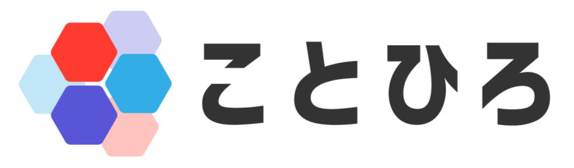

<div align="center">



# kotohiro API Server

ことひろは意見や言葉を重ねて、よりよい意思決定を目指すサービスです。

[![Go version][go_version_img]][go_dev_url]
[![Go report][go_report_img]][go_report_url]
[![License][repo_license_img]][repo_license_url]

</div>

## 🚀 開発環境

### 1. 前提パッケージのインストール

miseを用いてツールの管理をしています。

```sh
# macosの場合
brew install mise

# その他の環境
curl https://mise.run | sh
```

### 2. プロジェクトのセットアップ

リポジトリのクローン

```sh
git clone https://github.com/neko-dream/api.git
cd api
```

必要なツールのインストール

```sh
mise install
```

環境変数の設定

```sh
cp .env.example .env
```

### 3. コード生成

自動生成スクリプトを実行

```sh
./scripts/gen.sh
```

### 4. DBセットアップ

docker composeを使用します。
Docker Compose V2に対応したDockerをあらかじめインストールしてください、

```sh
docker compose up -d db
```

ユーザー名、パスワード、DB名は全て`kotohiro`です。

もしDockerを使用せず動かす場合は以下の要件を満たしたDBを使用してください。

- PostgreSQL 16
- PostGIS

### 5. ホットリロード

airを用いてホットリロードが可能

```sh
air
```

## ⚖️ License

ことひろ は GNU Affero General Public License v3.0 (AGPL-3.0) の下で提供されています。詳細については[LICENSE](LICENSE)をご確認ください。


<!-- Go links -->

[go_report_url]: https://goreportcard.com/report/github.com/neko-dream/api
[go_report_img]: https://img.shields.io/badge/Go_report-A+-success?style=for-the-badge&logo=none
[go_dev_url]: https://pkg.go.dev/github.com/neko-dream/api
[go_version_img]: https://img.shields.io/badge/Go-1.23+-00ADD8?style=for-the-badge&logo=go

<!-- Repository links -->

[repo_license_url]: https://github.com/neko-dream/api/blob/main/LICENSE
[repo_license_img]: https://img.shields.io/badge/license-AGPL--v3-red?style=for-the-badge&logo=none

